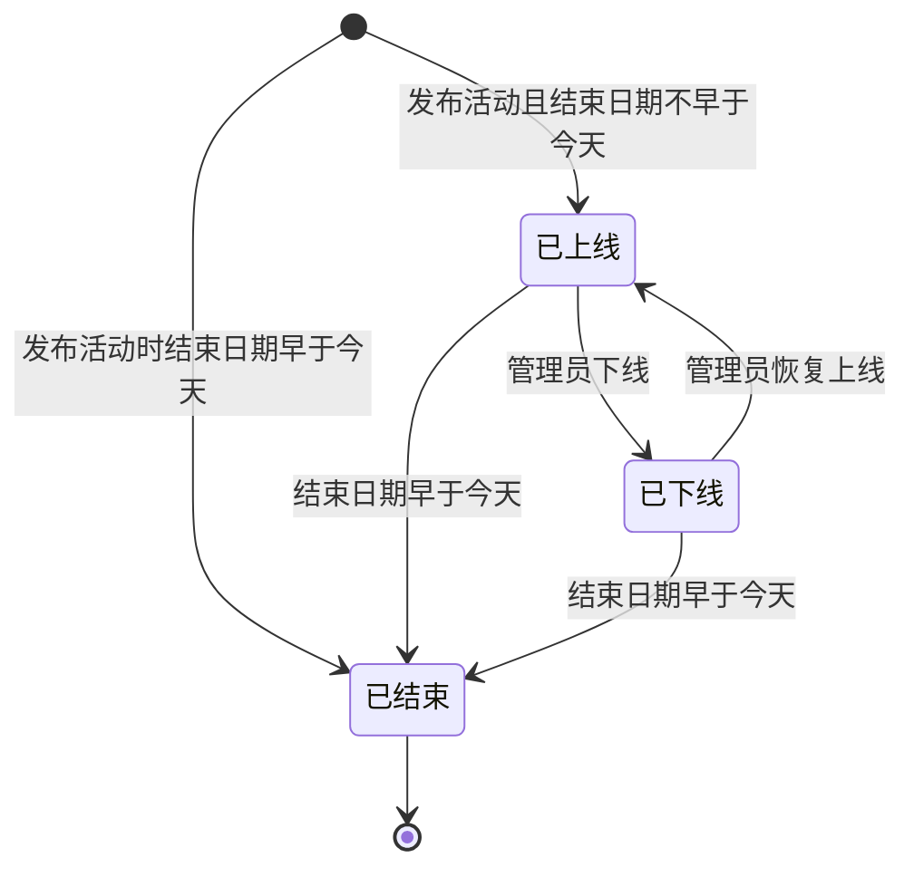
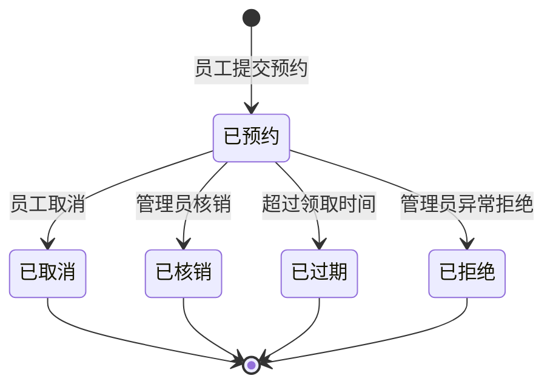
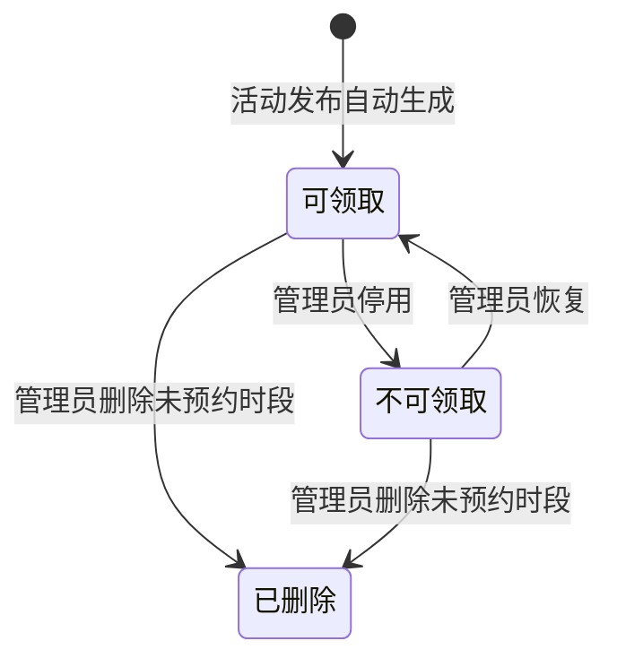
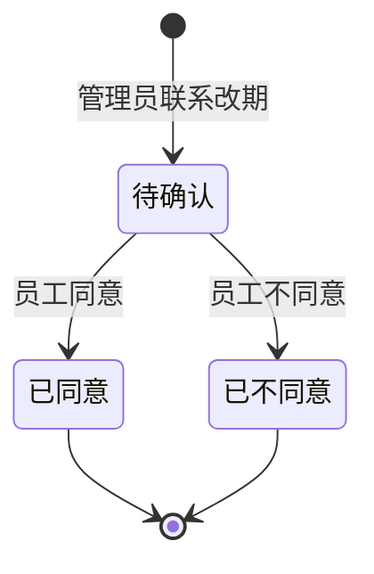
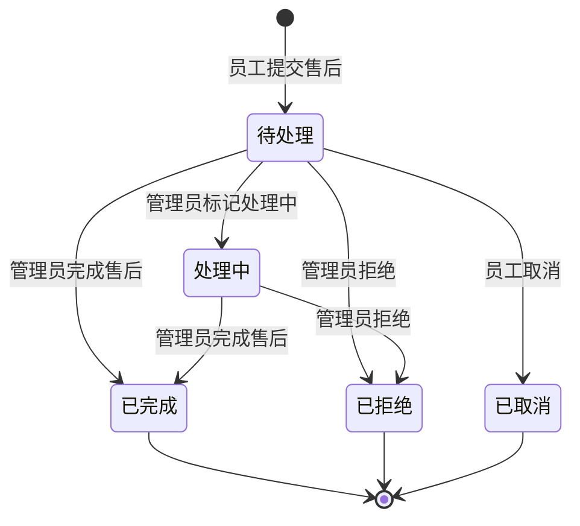

# GiftFlow 福利领取系统原型版 PRD

## 1. 产品定位

**产品名称**：GiftFlow 福利领取系统

**版本定位**：MVP 原型版，非生产级实现

**目标用户**：员工、行政管理员

**核心目标**：展示从“活动发布 -> 员工预约 -> 生成凭证 -> 现场核销 -> 库存变化 -> 数据统计”的完整福利领取闭环。

本版本重点验证核心业务流程，不追求生产级安全、真实外部系统集成和复杂企业级权限。

## 2. 本期范围

### 2.1 员工端

- 员工使用工号和手机号后四位登录
- 查看通知中心和未读通知
- 查看适用于自己的当前福利活动
- 查看本人可领取礼物
- 按部门自动过滤礼物资格
- 选择领取办公楼
- 查看该楼宇下本人可领取礼物
- 选择礼物
- 选择领取时间段
- 提交预约
- 生成领取凭证，包含验证码、二维码或领取详情
- 查看我的领取记录
- 取消未核销预约
- 对已核销领取记录提交售后申请
- 查看我的售后记录，并取消待处理售后
- 接收活动上线、预约成功、改期提醒、取消、过期和核销成功通知
- 接收售后提交、处理中、完成、拒绝和取消通知
- 对管理员发起的改期提醒进行同意或不同意反馈

### 2.2 管理后台

- 模拟管理员登录
- 创建福利活动
- 使用复制文字快速配置录入活动规则
- 系统将规则文案转换为结构化配置草稿
- 管理员在规则确认页手动修改并确认发布
- 维护礼物规则、楼宇分配、可领取日期
- 通过预约管理维护楼宇基础数据、具体领取时间段和可领取日历
- 查看预约列表
- 输入验证码或查看二维码信息完成核销
- 处理员工售后申请，并在完成售后时选择库存动作
- 查看库存变化、预约状态和数据看板

### 2.3 页面导航

原型版拆成两个入口页面：

- 员工端
- 管理后台

入口切换使用左侧竖向导航，可以通过 URL 跳转。员工端为单入口业务页面，不展示管理菜单。

管理后台登录后，左侧竖向展示一级菜单。管理后台内部菜单使用页面会话状态切换，不通过 URL 跳转，以避免内部切换导致登录态丢失。

- 活动发布
- 预约管理
- 预约核销
- 售后处理
- 数据看板

活动发布内部使用内容区顶部的 tabs：

- 活动配置
- 活动管理
- 历史活动

预约管理内部使用内容区顶部的 tabs：

- 时间管理
- 楼宇管理

## 3. 核心流程

### 3.1 系统总体流程

完整流程图见：[giftsys_system_flow.md](./giftsys_system_flow.md)。

管理端主线：

1. 管理员登录管理后台
2. 进入“活动发布”
3. 在“活动配置”中创建活动
4. 配置活动名称、日期范围、礼物、部门资格规则、初始库存和楼宇分配
5. 发布活动
6. 系统自动生成活动日期范围内的默认 `timeslots`
7. 系统向符合资格的员工生成活动上线通知
8. 在“活动管理”中维护仍在有效期内的已上线或已下线活动
9. 已超过结束日期的活动自动进入“历史活动”
10. 管理员可在“历史活动”中搜索、查看历史数据，并用“再次发布”生成新活动
11. 管理员进入“预约管理”
12. 在“时间管理”中查看月视图/日视图日历、快捷显示 timeslot 和预约明细
13. 在“时间段管理”中新增或删除未预约的 timeslot
14. 在“快捷显示 timeslot”中停用或恢复某个时段
15. 在“容量管理”中调整某个时段的可预约容量
16. 对已有预约发起联系改期，由系统生成员工端可确认通知
17. 在“楼宇管理”中维护楼宇地址、领取点、负责人、联系方式、备用负责人、状态和显示顺序
18. 楼宇信息被员工端用于选择领取楼宇、展示领取点和联系人
19. 现场领取时，管理员进入“预约核销”
20. 输入员工验证码完成核销
21. 系统将库存从“已预约占用”转为“已发放”
22. 如员工提交售后，管理员进入“售后处理”
23. 在“待处理”售后中打开售后单
24. 标记处理中、拒绝，或完成售后
25. 完成售后时选择库存动作
26. 系统写入库存流水、通知员工，并更新数据看板

员工端主线：

1. 员工使用工号和手机号后四位登录
2. 员工可以查看通知中心，了解活动上线、预约、改期、核销和售后状态
3. 员工也可以不经过通知中心，直接进入“福利领取”
4. 选择活动
5. 选择领取楼宇
6. 系统展示该楼宇下员工有资格且有库存的礼物
7. 员工选择礼物
8. 选择可预约 timeslot
9. 确认预约
10. 系统占用库存，生成领取凭证和预约成功通知
11. 员工在“我的领取”查看预约记录和验证码
12. 如未核销，员工可取消预约
13. 取消后系统释放库存并生成通知
14. 现场领取时员工出示验证码
15. 管理员核销后，员工收到核销成功通知
16. 已核销记录如有问题，员工在“我的领取”申请售后
17. 员工填写售后类型、期望处理方式、问题描述和联系方式
18. 员工在“我的售后”查看售后状态
19. 如售后仍为待处理，员工可取消售后
20. 管理员处理后，员工收到售后处理结果通知

系统自动动作：

1. 活动发布后自动生成默认 `timeslots`
2. 活动发布或恢复上线后，向符合资格员工生成通知
3. 员工查看礼物时，系统按部门资格、楼宇和库存过滤可领礼物
4. 预约成功后，系统占用库存并生成领取凭证
5. 取消预约或预约过期后，系统释放库存
6. 核销后，系统将库存转为已发放
7. 管理员联系改期后，系统生成员工端可操作改期通知；员工同意后迁移预约 timeslot
8. 售后完成后，系统根据库存动作调整库存并写入库存流水
9. 系统在活动列表、预约、日历、库存和看板查询前同步已过期活动状态
10. 结束日期早于今天的活动自动进入历史活动，不再允许新预约或普通活动管理修改
11. 数据看板实时汇总预约、核销、库存和售后相关数据

### 3.2 员工流程

1. 员工使用工号和手机号后四位登录
2. 进入个人福利工作台
3. 查看通知中心和自己的可领活动
4. 选择领取办公楼
5. 查看该楼宇下本人可领取礼物
6. 选择礼物和领取时间段
7. 提交预约
8. 系统生成领取凭证
9. 现场由管理员核销
10. 领取记录变为已核销
11. 员工收到预约、改期、核销等状态通知
12. 如礼品存在问题，员工在已核销记录上提交售后申请
13. 管理员处理售后并选择库存动作
14. 员工收到售后处理结果通知

### 3.3 管理员流程

1. 管理员登录
2. 创建活动
3. 输入或粘贴活动规则文案
4. 系统转换为配置草稿
5. 管理员进入规则确认页
6. 修改并确认活动发布配置
7. 发布活动
8. 管理楼宇基础数据
9. 查看员工预约
10. 现场核销凭证
11. 查看数据看板

## 4. 功能设计

功能设计按员工端、管理端和系统自动动作组织，不把业务能力附着在单一的快速配置入口下。快速配置只是“活动发布”的一种录入方式，所有配置在发布前都必须经过人工确认。

### 4.1 员工端

员工端用于完成个人福利领取、凭证查看、通知确认和售后申请。

核心能力：

- 使用工号和手机号后四位登录
- 查看通知中心和未读通知
- 查看适用于自己的已上线活动
- 先选择领取楼宇，再查看该楼宇下本人有资格且有库存的礼物
- 选择礼物和可领取 timeslot 后提交预约
- 预约成功后查看验证码和二维码模拟凭证
- 在“我的领取”查看预约、取消、已核销等领取记录
- 对未核销预约发起取消
- 对已核销领取记录提交售后申请
- 在“我的售后”查看售后状态，并取消待处理售后
- 对管理员发起的改期提醒进行同意或不同意反馈

员工端展示规则：

- 员工只能看到已上线、未结束且符合资格规则的活动
- 员工只能看到本人部门或“全员”规则下可领取的礼物
- 员工选择楼宇后，系统只展示该楼宇有库存的礼物
- 同一员工同一活动默认只能存在一条有效预约
- 已核销、已取消、已过期或已拒绝的领取记录只读展示

### 4.2 管理端：活动发布

活动发布用于创建和维护福利活动，是管理后台的核心入口。

活动发布内部包含三个 tabs：

- 活动配置
- 活动管理
- 历史活动

活动配置支持两种录入方式：

- 直接配置：管理员点击“配置活动”，从空白表单开始逐项填写
- 复制文字快速配置：管理员粘贴规则文案，由 AI 生成结构化配置草稿

直接配置字段：

- 活动名称
- 开始日期
- 结束日期
- 活动描述
- 是否允许取消预约
- 是否过期释放库存
- 礼物规则行

每个礼物规则行包含：

- 礼物名称
- 部门，下拉选择，来源于员工部门列表，并额外支持“全员”
- 初始数量
- 描述
- 楼宇分配比例

楼宇分配规则：

- 楼宇为基础数据，由“预约管理 > 楼宇管理”维护
- 活动发布时读取当前启用楼宇作为分配对象
- 同一礼物下所有楼宇比例合计必须为 100%
- 发布活动时，系统按比例将该礼物初始库存分配到各楼宇

活动日期规则：

- 活动配置只维护开始日期和结束日期
- 具体每天可预约的小时段不在活动配置中手工维护
- 活动发布成功后，系统根据日期范围自动生成默认 timeslots
- 后续通过“预约管理 > 时间管理”增删改具体时间段

### 4.3 管理端：复制文字快速配置

复制文字快速配置是辅助录入工具，不是自动发布工具。

目标是将规则文案转换为结构化 JSON，再填入活动配置表单。管理员必须在表单中确认或修改后，活动才可发布。

输入示例：

> 2026 年春节福利，技术部可选机械键盘或降噪耳机，销售部领取 500 元购物卡，全员可领零食礼包。A 楼分配 50%，B 楼 30%，C 楼 20%。活动日期为 2 月 1 日到 2 月 3 日。

目标 JSON 结构：

```json
{
  "activity": {
    "name": "2026年端午福利",
    "activity_type": "节日福利",
    "description": "活动说明",
    "start_date": "2026-06-20",
    "end_date": "2026-06-22",
    "allow_cancel": true,
    "expire_release": true
  },
  "gift_rules": [
    {
      "name": "机械键盘",
      "department": "技术部",
      "total_stock": 30,
      "description": "87键无线机械键盘",
      "building_allocation": {
        "A楼": 50,
        "B楼": 30,
        "C楼": 20
      }
    }
  ]
}
```

AI 快速配置环境变量：

- `GIFTSYS_GEMINI_API_KEY`：Google AI Studio API Key
- `GIFTSYS_GEMINI_MODEL`：Gemini 模型名称
- `GIFTSYS_GEMINI_API_KEY_FILE`：本地 key 文件路径，默认 `.secrets/google_ai_studio_api_key.txt`
- `GIFTSYS_AI_API_KEY`：OpenAI-compatible API Key，未配置时可使用 `OPENAI_API_KEY`
- `GIFTSYS_AI_MODEL`：OpenAI-compatible 模型名称
- `GIFTSYS_AI_BASE_URL`：OpenAI-compatible API 地址
- `GIFTSYS_AI_TIMEOUT_SECONDS`：接口超时时间

### 4.4 管理端：活动管理和历史活动

活动管理用于维护仍在有效期内的已上线或已下线活动。

支持能力：

- 查看已上线和已下线活动列表
- 查看活动状态、日期范围、礼物数、已预约数、已核销数
- 编辑活动名称、描述、开始日期、结束日期、取消规则和过期释放规则
- 延长活动日期时，自动为新增日期生成默认 timeslots
- 缩短活动日期时，如果被移除日期已有预约记录，则禁止保存
- 增发新礼物，并按活动当前楼宇分配库存
- 调整已有礼物库存，支持补充库存和减少可用库存
- 减少库存时只能减少当前可用库存，不能影响已预约和已发放库存
- 下线活动或恢复上线，操作需要二次确认

历史活动用于查看已结束活动并复用模板。

历史活动规则：

- 活动结束日期早于今天时，系统自动将状态同步为已结束
- 创建新活动时，如果结束日期早于今天，活动创建后直接进入历史活动
- 已结束活动不进入员工端活动列表、管理端普通活动下拉栏和预约时间管理活动选择
- 已结束活动禁止新增预约、恢复上线、下线、编辑活动信息、增发礼物、调整库存和修改 timeslot
- 历史活动支持搜索
- 历史活动条目展示礼品数、总库存、已发放、剩余可用库存、领取员工数和礼物明细
- 点击“再次发布”后，系统以历史活动为模板创建新活动配置草稿
- 再次发布弹窗可调整活动日期、活动描述、礼物规则、库存和楼宇分配

### 4.5 管理端：预约管理

预约管理用于维护活动发布后员工端实际看到的领取楼宇、领取日期和 timeslots。

预约管理内部包含：

- 时间管理
- 楼宇管理

时间管理支持：

- 使用月视图和日视图查看可领取日、快捷显示 timeslot 和预约明细
- 活动发布后自动生成日期范围内默认 timeslots
- 默认 timeslots 为 `10:00-11:00`、`11:00-12:00`、`12:00-12:30`、`14:00-15:00`、`15:00-16:00`、`16:00-17:00`、`17:00-18:00`、`18:00-18:30`
- 时间段管理中通过弹窗新增或删除未预约 timeslot
- 容量管理中选择具体 timeslot 后修改容量
- 点击快捷显示 timeslot 按钮，可将时段设为不可领取或恢复可领取
- 停用、恢复和删除时间段需要二次确认
- 已有预约的时间段不可直接删除，容量不可调低到小于已预约人数

可领取日历展示：

- 当日在线活动
- 按楼宇和活动展示快捷显示 timeslot
- 有预约的 timeslot 保持高亮并展开预约信息
- 预约明细包含领取人、部门、活动、礼品、核销码
- 每条预约明细提供“联系改期”按钮

联系改期规则：

- 管理员选择目标日期和目标时间段
- 系统模拟发送固定短信到员工手机号
- 系统生成员工端改期提醒通知
- 员工同意后，系统校验目标 timeslot 仍可领取、同活动、同楼宇且未满员
- 校验通过后，旧 timeslot 预约数减少，新 timeslot 预约数增加，预约记录更新到新时间
- 员工不同意时，仅记录反馈，不修改原预约

楼宇管理字段：

| 字段 | 说明 |
|---|---|
| 楼宇名称 | 如 A楼、B楼、C楼。已有楼宇不直接改名，以免影响历史库存和预约记录 |
| 楼宇地址 | 员工实际前往的办公地址 |
| 领取点位置 | 如 1层行政前台、3层行政服务台、B1 仓储发放点 |
| 负责人姓名 | 负责该楼宇发放或协调的行政人员 |
| 负责人联系方式 | 手机、企业微信或内线电话 |
| 备用负责人 | 负责人不在时的替补联系人 |
| 显示顺序 | 控制员工端和管理端楼宇展示顺序，使用 1、2、3 这类自然序号 |
| 楼宇状态 | 启用 / 停用。停用后员工端不再展示该楼宇 |
| 备注 | 特殊说明，如“需携带工牌”“进入仓储区需负责人带领” |

### 4.6 管理端：预约核销

预约核销用于现场发放。

支持能力：

- 选择活动查看预约列表
- 输入员工验证码完成核销
- 核销时展示员工、部门、礼物、楼宇、时间等信息供管理员核对
- 凭证错误时提示失败
- 已核销凭证再次核销时提示已核销
- 核销成功后，系统将库存从已预约占用转为已发放，并生成员工通知

### 4.7 售后处理

售后处理用于管理员处理员工领取后的破损、发错、规格不符、无法使用、补发或更换等情况。

员工端能力：

- 员工只能对已核销领取记录提交售后申请
- 员工填写售后类型、期望处理方式、问题描述和联系方式
- 待处理售后允许员工取消
- 同一领取记录不允许重复提交售后

管理端能力：

- 售后处理分为“待处理”和“历史售后”两个 tabs
- 支持按活动、员工、工号、礼物或验证码筛选售后单
- 每条售后记录右侧提供处理或查看按钮，通过弹窗处理
- 管理员可标记处理中、拒绝售后或完成售后
- 完成售后时选择库存动作
- 售后完成、拒绝、处理中状态变化时生成员工通知

售后类型：

- 破损
- 发错礼品
- 规格不符
- 无法使用
- 其他

期望处理方式：

- 更换
- 补发
- 退回登记
- 人工联系

售后库存动作：

| 库存动作 | 库存影响 | 适用场景 |
|---|---|---|
| 不调整库存 | 不改库存，只记录售后完成 | 人工联系、解释说明、无需实物处理 |
| 补发出库 | 可用库存 -1，已发放库存 +1 | 员工保留原礼品，额外补发一份 |
| 退回可再发 | 可用库存 +1，已发放库存 -1 | 员工退回礼品，礼品可再次发放 |
| 换货：退回可再发 + 新发出库 | 先退回可再发，再新发出库，写两条流水 | 原礼品可回收，新礼品重新发出 |
| 换货：退回报废 + 新发出库 | 原礼品不恢复库存，新礼品可用库存 -1，已发放库存 +1 | 原礼品破损报废，需要重新发 |
| 退回报废 | 不恢复可用库存，只记录报废流水 | 礼品退回但不可再次发放 |

库存校验：

- 补发和换货出库时，必须校验对应活动、礼物、楼宇仍有可用库存
- 库存不足时禁止完成售后库存动作
- 退回可再发时，已发放库存不能被扣成负数
- 每次售后库存变化必须写入库存流水

### 4.8 系统自动动作

系统自动动作负责串联业务闭环：

- 活动发布后生成默认 timeslots
- 活动发布或恢复上线后，向符合资格规则的员工生成通知
- 活动、预约、日历、库存和看板查询前同步已过期活动状态
- 员工预约时再次校验活动状态、资格、库存和时间段容量
- 预约成功后占用库存并生成凭证
- 取消、过期、核销、售后完成时写入库存流水
- 员工通知写入通知中心
- 管理员关键操作写入操作日志
- 数据看板汇总活动、预约、库存、核销、售后和通知反馈

## 5. 状态机设计

### 5.1 活动状态机



| 状态 | 含义 | 可操作 |
|---|---|---|
| 已上线 `published` | 员工端可见，可预约 | 可下线、编辑、增发礼物、调库存、调时间 |
| 已下线 `offline` | 员工端不可见，不可预约 | 可恢复上线、编辑、调库存、调时间 |
| 已结束 `ended` | 活动期结束，进入历史活动 | 不可修改，只能作为模板再次发布 |

### 5.2 预约领取状态机



| 状态 | 含义 | 库存影响 | 后续操作 |
|---|---|---|---|
| 已预约 `reserved` | 员工预约成功 | 可用库存 -1，占用库存 +1 | 可取消、核销、改期、过期 |
| 已取消 `cancelled` | 员工取消预约 | 占用库存释放回可用库存 | 结束状态，可重新预约活动 |
| 已核销 `redeemed` | 管理员完成现场发放 | 占用库存转已发放 | 结束状态，可申请售后 |
| 已过期 `expired` | 超过领取时间未领取 | 占用库存释放回可用库存 | 结束状态，可重新预约活动 |
| 已拒绝 `rejected` | 管理员异常处理拒绝 | 占用库存释放回可用库存 | 结束状态 |

### 5.3 Timeslot 状态机



| 状态 | 含义 | 限制 |
|---|---|---|
| 可领取 `is_available=1` | 员工端可选择 | 剩余容量必须大于 0 |
| 不可领取 `is_available=0` | 员工端不可选择 | 已有预约时不可直接停用 |
| 已删除 | 时间段从可选范围移除 | 已有预约记录时不可删除 |

### 5.4 改期通知状态机



| 状态 | 含义 | 系统动作 |
|---|---|---|
| 待确认 `pending` | 员工尚未处理改期提醒 | 保留原预约 |
| 已同意 `accepted` | 员工同意目标时间 | 校验目标 timeslot 后迁移预约 |
| 已不同意 `declined` | 员工拒绝改期 | 记录反馈，不修改预约 |

### 5.5 售后状态机



| 状态 | 含义 | 可操作 |
|---|---|---|
| 待处理 `pending` | 员工已提交，管理员未处理 | 员工可取消；管理员可处理 |
| 处理中 `processing` | 管理员已接单处理 | 管理员可完成或拒绝 |
| 已完成 `resolved` | 售后处理完成 | 结束状态 |
| 已拒绝 `rejected` | 管理员拒绝售后 | 结束状态 |
| 已取消 `cancelled` | 员工取消售后 | 结束状态 |

### 5.6 库存状态流转

库存不是单独页面状态，而是随业务动作变化：

| 动作 | 可用库存 | 占用库存 | 已发放库存 | 已释放库存 | 流水 |
|---|---:|---:|---:|---:|---|
| 预约成功 | -1 | +1 | 不变 | 不变 | `reserve` |
| 取消预约 | +1 | -1 | 不变 | +1 | `cancel` |
| 预约过期 | +1 | -1 | 不变 | +1 | `expire` |
| 核销成功 | 不变 | -1 | +1 | 不变 | `redeem` |
| 补充库存 | +N | 不变 | 不变 | 不变 | `stock_increase` |
| 减少可用库存 | -N | 不变 | 不变 | 不变 | `stock_decrease` |
| 售后补发 | -1 | 不变 | +1 | 不变 | `after_sale_reissue` |
| 售后退回可再发 | +1 | 不变 | -1 | 不变 | `after_sale_return_restock` |

## 6. 数据表设计

核心表：

| 表名 | 用途 |
|---|---|
| employees | 员工信息 |
| admins | 管理员信息 |
| activities | 福利活动 |
| gifts | 礼物信息 |
| eligibility_rules | 资格规则 |
| buildings | 楼宇基础数据 |
| inventory | 楼栋维度库存 |
| time_slots | 领取时间段 |
| claims | 预约和领取记录 |
| after_sales | 售后申请和处理记录 |
| notifications | 员工通知和可操作改期提醒 |
| inventory_logs | 库存流水 |
| operation_logs | 管理员操作日志 |

关键约束：

- `claims.activity_id + claims.employee_id` 默认只允许一条有效预约
- `claims.claim_code` 必须唯一
- 核销时必须校验 `claim_code`
- 库存变化必须写入 `inventory_logs`
- 管理员关键操作写入 `operation_logs`
- 员工通知写入 `notifications`
- 可操作改期通知通过 `action_status` 记录待确认、已同意或已不同意
- 售后单通过 `status` 记录待处理、处理中、已完成、已拒绝、已取消
- 售后完成时的库存动作写入 `after_sales.inventory_action` 和 `inventory_logs.action`

## 7. 数据指标与优化闭环

本系统的优化目标不是只完成一次领取，而是让行政能够根据数据持续优化下一次福利发放。

核心指标：

| 指标 | 计算口径 | 优化用途 |
|---|---|---|
| 活动覆盖人数 | 符合资格规则的员工数 | 判断活动配置是否覆盖目标人群 |
| 活动预约率 | 已预约员工数 / 覆盖人数 | 判断活动吸引力和通知触达效果 |
| 核销率 | 已核销数 / 已预约数 | 判断实际领取完成度 |
| 取消率 | 已取消数 / 已预约数 | 判断活动时间、楼宇、礼品是否需要调整 |
| 过期未领率 | 已过期数 / 已预约数 | 判断提醒、时间段和现场发放安排是否合理 |
| timeslot 利用率 | 已预约人数 / timeslot 容量 | 优化时间段容量和发放人手 |
| 楼宇库存消耗率 | 楼宇已发放数 / 楼宇总库存 | 优化楼宇分配比例 |
| 礼物剩余率 | 礼物剩余库存 / 礼物总库存 | 判断补货、调拨或下次选品方向 |
| 售后率 | 售后单数 / 已核销数 | 评估礼品质量和供应商稳定性 |
| 售后完成时长 | 售后完成时间 - 售后提交时间 | 优化行政处理效率 |
| 改期接受率 | 同意改期数 / 改期通知数 | 评估改期沟通有效性 |

数据来源：

- `activities`：活动状态、日期范围和历史活动
- `eligibility_rules`：资格覆盖范围
- `claims`：预约、取消、核销、过期和拒绝状态
- `time_slots`：容量、剩余名额和时间段启停状态
- `inventory`：总库存、可用库存、占用库存、已发放库存和已释放库存
- `after_sales`：售后状态、问题类型和库存动作
- `notifications`：通知类型、改期确认状态和未读状态
- `inventory_logs`：每次库存变化流水
- `operation_logs`：管理员关键操作记录

优化闭环：

1. 管理员发布活动，系统生成 timeslots、资格范围、库存分配和活动通知
2. 员工预约、取消、改期、核销和售后会持续写入业务表和流水表
3. 数据看板汇总预约率、核销率、库存消耗、timeslot 利用率、楼宇压力和售后质量
4. 管理员根据数据调整仍在有效期内的活动，包括增发礼物、调整库存、调整容量、停用低效时段或联系改期
5. 活动结束后进入历史活动，沉淀为可搜索、可复用的活动模板
6. 下一次活动通过“再次发布”复用历史配置，并结合历史指标优化礼品、楼宇比例、库存和领取时间

这一闭环使系统从“登记工具”变成“福利运营工具”：每次发放产生的数据都会反哺下一次活动配置。

## 8. 异常处理

本期必须覆盖以下异常：

- 重复预约：同一员工同一活动已有有效预约时，不允许再次预约
- 库存不足：提交预约和售后补发时再次校验库存
- 时间段满员：提交预约时再次校验 timeslot 容量
- 活动已下线：员工端不展示，服务端拒绝新预约
- 活动已结束：不进入普通活动选择，不允许预约、修改、调库存或改 timeslot
- 验证码错误：管理员核销失败并提示
- 重复核销：已核销凭证再次核销时提示已核销
- 已核销后取消：不允许取消
- 过期未领取：系统或管理员触发过期处理，释放库存
- 凭证转发：凭证绑定员工和预约记录，核销时展示员工姓名供管理员核对
- 缩短活动日期：如果被移除日期已有预约记录，则禁止保存
- 时间段误操作：已有预约的 timeslot 不允许直接删除或停用
- 联系改期：员工同意后才变更预约时间，不同意则保留原预约
- 售后重复提交：同一领取记录已有售后单时，不允许重复提交
- 售后库存不足：补发或换货出库时，如果可用库存不足，禁止完成售后库存动作
- 售后状态误操作：已完成、已拒绝、已取消的售后单不可再次处理

## 9. 技术栈

原型版技术栈：

- 界面：Streamlit
- 数据库：SQLite
- 数据处理：Pandas
- 登录：员工端使用工号 + 手机号后四位，管理员端使用 Streamlit session state 模拟身份
- AI 快速配置：LLM 根据活动文案输出结构化 JSON
- 日历组件：使用 `streamlit-calendar` 展示月视图和按楼宇分组的日视图
- 二维码：生成二维码图片，或使用验证码模拟核销

## 10. 验收标准

原型通过标准：

- 管理员可以创建活动
- 复制文字快速配置可以生成配置草稿
- 配置草稿可以人工确认和修改
- 活动可以发布
- 员工端可以使用工号和手机号后四位登录
- 员工端可以查看通知中心和未读通知
- 活动发布页使用 tabs 切换活动配置、活动管理和历史活动
- 配置活动区域有单独标题
- 活动发布后，符合资格规则的员工可以收到活动上线通知
- 预约成功、取消、过期、核销成功会生成员工通知
- 管理员联系改期后，员工端收到可操作改期通知
- 员工同意改期时，系统校验目标 timeslot 后更新预约时间
- 员工不同意改期时，系统记录反馈且不修改原预约
- 员工端使用 tabs 展示福利领取、我的领取、我的售后
- 已核销领取记录右上角可以用主题色小按钮提交售后申请
- 员工可以查看我的售后记录，并取消待处理售后
- 管理后台可以在“售后处理”中按待处理和历史售后查看售后单，并通过记录右侧按钮打开弹窗处理
- 管理员可以将售后标记处理中、拒绝或完成
- 管理员完成售后时可以选择库存动作
- 售后补发、退回、换货和报废动作会写入库存流水
- 补发或换货出库库存不足时必须禁止完成售后
- 售后状态变化会生成员工通知
- 直接配置活动时，礼物清单初始为空，可通过新增礼物逐条配置
- 礼物配置字段包含礼物名称、部门、初始数量、描述
- 楼宇分配按滑条配置，同一礼物比例合计必须为 100%
- 活动发布配置只维护可领取日期范围
- 活动发布后自动生成日期范围内全部默认 timeslots
- 活动管理可以查看已发布和已下线活动
- 活动管理可以编辑活动基础信息和日期范围
- 活动日期延长时自动生成新增日期的默认 timeslots
- 活动日期缩短时，如果被移除日期已有预约记录，则禁止保存
- 活动管理可以增发新礼物，并按楼宇分配库存
- 活动管理可以调整已有礼物库存，增加库存或减少可用库存
- 减少库存数量超过当前可用库存时必须禁止操作
- 活动可以下线和恢复上线，下线后员工端不再展示
- 已下线活动在有效期内仍可进入活动管理并恢复上线
- 结束日期早于今天的活动自动进入历史活动
- 已结束活动不在员工端活动列表和管理端普通活动下拉栏展示
- 已结束活动不能预约、修改、调库存或恢复上线
- 历史活动支持按名称或描述搜索
- 历史活动条目展示礼品、库存、发放、剩余和领取员工数
- 历史活动可以通过“再次发布”弹窗生成新活动模板
- 预约管理可以新增、停用、恢复、调整和删除某一天的具体领取时间段
- 停用或恢复时间段必须二次确认
- 预约管理可以用月日历查看可领取日、当日活动、“快捷显示timeslot”和预约明细
- 预约明细包含领取人、部门、活动、领取礼品和核销码，并提供联系改期按钮
- 联系改期按钮打开弹窗，可选择目标日期和目标时间段，模拟发送固定短信并记录操作日志
- 文案快速配置生成的 JSON 可以自动填入配置表单
- 管理后台可以新增楼宇
- 管理后台可以维护楼宇地址、领取点、负责人、联系方式、备用负责人、排序、状态和备注
- 员工端可以先选楼宇，再看到该楼宇下本人可领取礼物
- 员工端选择楼宇后可以看到该楼宇地址、领取点和负责人信息
- 员工只能看到自己有资格领取的礼物
- 员工可以完成预约
- 预约后库存变为占用
- 员工可以看到领取凭证
- 管理员可以核销凭证
- 核销后记录变为已核销
- 核销后库存变为已发放
- 取消预约后库存释放
- 重复预约、重复核销、库存不足有明确提示
- 看板能展示预约数、已核销数、剩余库存
- 看板能支撑活动复盘，包括预约率、核销率、库存消耗、timeslot 利用和售后情况
- 历史活动可以作为下一次活动模板，形成“发布 -> 领取 -> 核销 -> 售后 -> 数据复盘 -> 再次发布”的闭环

## 11. 实施与变更记录

具体实现步骤、阶段检查点、变更记录和测试命令不在 PRD 中展开维护，统一见：[giftsys_implementation_log.md](./giftsys_implementation_log.md)。

PRD 只保留产品范围、业务规则、状态机、数据指标和验收标准；实现记录负责说明代码如何落地、何时变更、如何验证。

功能级测试辅助说明：

- 管理端保留隐藏测试入口，不出现在正式菜单中
- 隐藏入口地址为 `?portal=admin&tool=reservation_test`
- 测试入口可选择单个或多个员工模拟真实预约
- 测试入口创建的预约是真实数据，会占用库存并生成员工通知

## 12. 未来迭代

未来迭代不逐条展开，按方向归类：

- 企业集成：企业微信登录、企业微信消息、短信验证码、真实移动端扫码核销
- 数据导入导出：Excel 批量导入员工、活动和库存，报表导出，批量标签或二维码打印
- 规则增强：职级、入职时长、特殊名单、多份领取、多活动叠加和复杂资格冲突检测
- 生产架构：标准前后端分离、PostgreSQL/MySQL、Redis 并发控制、权限体系、审计冲正、监控告警和安全加固
- 智能运营：活动复盘总结、补货建议、礼品选择建议、楼宇分配和时间段容量优化建议
