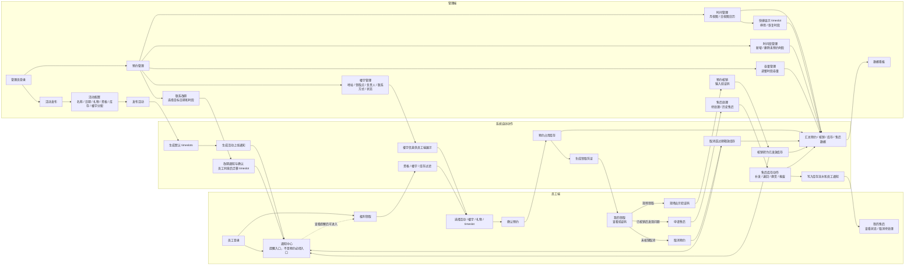

# GiftFlow 系统总体流程

本文档用于从“员工端”和“管理端”两个主体出发，说明 GiftFlow 的完整业务闭环。前半部分是文字流程，后半部分是 Mermaid 流程图。

## 1. 文字流程

### 1.1 管理端主线

1. 管理员登录管理后台。
2. 进入“活动发布”。
3. 在“活动配置”中创建活动。
4. 配置活动名称、日期范围、礼物、部门资格规则、初始库存和楼宇分配。
5. 发布活动。
6. 系统自动生成活动日期范围内的默认 `timeslots`。
7. 系统向符合资格的员工生成活动上线通知。
8. 管理员进入“预约管理”。
9. 在“时间管理”中查看月视图/日视图日历、快捷显示 timeslot 和预约明细。
10. 在“时间段管理”中新增或删除未预约的 timeslot。
11. 在“快捷显示 timeslot”中停用或恢复某个时段。
12. 在“容量管理”中调整某个时段的可预约容量。
13. 对已有预约发起联系改期，由系统生成员工端可确认通知。
14. 在“楼宇管理”中维护楼宇地址、领取点、负责人、联系方式、备用负责人、状态和显示顺序。
15. 楼宇信息被员工端用于选择领取楼宇、展示领取点和联系人。
16. 现场领取时，管理员进入“预约核销”。
17. 输入员工验证码完成核销。
18. 系统将库存从“已预约占用”转为“已发放”。
19. 如员工提交售后，管理员进入“售后处理”。
20. 在“待处理”售后中打开售后单。
21. 标记处理中、拒绝，或完成售后。
22. 完成售后时选择库存动作。
23. 系统写入库存流水、通知员工，并更新数据看板。

### 1.2 员工端主线

1. 员工使用工号和手机号后四位登录。
2. 员工可以查看通知中心，了解活动上线、预约、改期、核销和售后状态。
3. 员工也可以不经过通知中心，直接进入“福利领取”。
4. 选择活动。
5. 选择领取楼宇。
6. 系统展示该楼宇下员工有资格且有库存的礼物。
7. 员工选择礼物。
8. 选择可预约 timeslot。
9. 确认预约。
10. 系统占用库存，生成领取凭证和预约成功通知。
11. 员工在“我的领取”查看预约记录和验证码。
12. 如未核销，员工可取消预约。
13. 取消后系统释放库存并生成通知。
14. 现场领取时员工出示验证码。
15. 管理员核销后，员工收到核销成功通知。
16. 已核销记录如有问题，员工在“我的领取”申请售后。
17. 员工填写售后类型、期望处理方式、问题描述和联系方式。
18. 员工在“我的售后”查看售后状态。
19. 如售后仍为待处理，员工可取消售后。
20. 管理员处理后，员工收到售后处理结果通知。

### 1.3 系统自动动作

1. 活动发布后自动生成默认 `timeslots`。
2. 活动发布或恢复上线后，向符合资格员工生成通知。
3. 员工查看礼物时，系统按部门资格、楼宇和库存过滤可领礼物。
4. 预约成功后，系统占用库存并生成领取凭证。
5. 取消预约或预约过期后，系统释放库存。
6. 核销后，系统将库存转为已发放。
7. 管理员联系改期后，系统生成员工端可操作改期通知；员工同意后迁移预约 timeslot。
8. 售后完成后，系统根据库存动作调整库存并写入库存流水。
9. 数据看板实时汇总预约、核销、库存和售后相关数据。

## 2. 流程图

