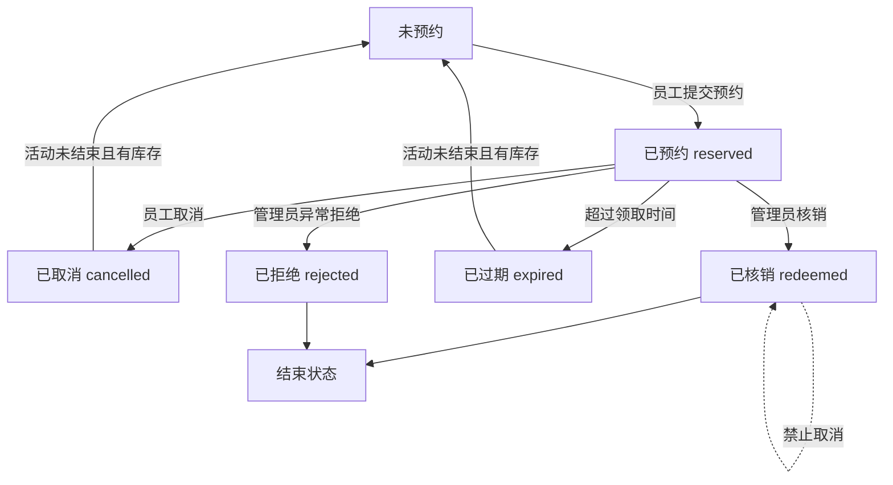

# GiftFlow 福利领取系统 Demo 版 PRD

## 1. 产品定位

**产品名称**：GiftFlow 福利领取系统

**版本定位**：Demo / MVP 原型版

**目标周期**：1-2 天

**目标用户**：员工、行政管理员

**核心目标**：展示从“活动配置 -> 员工预约 -> 生成凭证 -> 现场核销 -> 库存变化 -> 数据统计”的完整福利领取闭环。

本版本重点验证核心业务流程，不追求生产级安全、真实外部系统集成和复杂企业级权限。

## 2. 本期范围

### 2.1 员工端

- 模拟员工登录
- 查看当前福利活动
- 查看本人可领取礼物
- 按部门自动过滤礼物资格
- 选择礼物
- 选择领取办公楼
- 选择领取时间段
- 提交预约
- 生成领取凭证，包含验证码、二维码或领取详情
- 查看我的领取记录
- 取消未核销预约

### 2.2 管理端

- 模拟管理员登录
- 创建福利活动
- 使用自然语言输入活动规则
- 系统解析自然语言，生成结构化配置草稿
- 管理员在规则确认页手动修改并确认发布
- 维护礼物、库存、部门资格规则、楼栋分配、领取时间段
- 查看预约列表
- 输入验证码或查看二维码信息完成核销
- 查看库存变化
- 查看基础发放统计

## 3. 核心流程

### 3.1 员工流程

1. 员工选择身份登录
2. 进入活动大厅
3. 查看当前活动和可领取礼物
4. 选择礼物
5. 选择办公楼和领取时间段
6. 提交预约
7. 系统生成领取凭证
8. 现场由管理员核销
9. 领取记录变为已核销

### 3.2 管理员流程

1. 管理员登录
2. 创建活动
3. 输入自然语言活动描述
4. 系统解析为配置草稿
5. 管理员进入规则确认页
6. 修改并确认活动配置
7. 发布活动
8. 查看员工预约
9. 现场核销凭证
10. 查看库存和发放统计

## 4. 自然语言配置

### 4.1 功能定位

自然语言配置是**辅助录入工具**，不是自动发布工具。

它类似“解析简历后自动填表”：系统负责把自然语言拆成结构化草稿，管理员负责最终确认。

### 4.2 输入示例

> 2026 年春节福利，技术部可选机械键盘或降噪耳机，销售部领取 500 元购物卡，全员可领零食礼包。A 楼分配 50%，B 楼 30%，C 楼 20%。领取时间为 2 月 1 日到 2 月 3 日，每天 10-12 点和 14-16 点。

### 4.3 解析结果

系统生成以下配置草稿：

- 活动名称
- 活动开始日期和结束日期
- 礼物清单
- 部门资格规则
- 全员默认礼物
- 楼栋库存分配
- 领取时间段
- 每个时间段预约上限
- 是否允许取消预约
- 过期处理规则

### 4.4 人工确认规则

AI 解析结果不得直接发布。

管理员必须在规则确认页确认以下内容后，活动才可生效：

- 活动名称和日期
- 礼物名称、规格、库存
- 部门与礼物池对应关系
- 全员默认礼物
- 楼栋库存分配
- 时间段容量
- 取消预约规则
- 过期释放规则

## 5. 领取状态机

### 5.1 流程图

### 5.2 状态说明

| 状态 | 含义 | 库存影响 | 是否可继续操作 |
|---|---|---|---|
| 未预约 | 员工尚未提交预约 | 无影响 | 可预约 |
| 已预约 | 员工已预约成功 | 占用库存 | 可取消、可核销、可过期 |
| 已取消 | 员工主动取消预约 | 释放库存 | 可重新预约 |
| 已核销 | 管理员完成现场发放 | 占用库存转为已发放 | 不可取消、不可重复核销 |
| 已过期 | 超过领取时间未领取 | 释放库存 | 可重新预约 |
| 已拒绝 | 管理员异常处理拒绝 | 释放库存 | 本 Demo 中作为结束状态 |

## 6. 库存扣减策略

Demo 版采用“预约占用库存”策略。

规则如下：

- 员工预约成功时，减少可用库存，增加占用库存
- 员工取消预约时，释放占用库存
- 预约过期时，释放占用库存
- 管理员核销时，占用库存转为已发放库存
- 同一员工在同一活动中默认只能有一条有效预约
- 礼物库存不足时，不允许预约
- 某楼栋某时间段达到预约上限时，不允许继续选择
- 每次库存变化都记录库存流水

库存字段建议：

- 总库存
- 可用库存
- 已占用库存
- 已发放库存
- 已释放库存

## 7. 资格规则

Demo 版优先支持**部门规则**和**全员默认礼物**。

规则如下：

- 员工根据所属部门看到对应礼物池
- 如果配置了全员默认礼物，则所有员工都可见
- 如果员工同时命中部门礼物和全员默认礼物，则都展示
- 每人每活动默认限领 1 份
- 如果同一活动下有多个可选礼物，员工只能选择其中 1 份预约

示例：

| 员工部门 | 可见礼物 |
|---|---|
| 技术部 | 机械键盘、降噪耳机、全员零食礼包 |
| 销售部 | 购物卡、全员零食礼包 |
| 职能部 | 全员零食礼包 |

## 8. 异常处理

本期必须覆盖以下异常：

- 重复预约：同一员工同一活动已有有效预约时，不允许再次预约
- 库存不足：提交预约时再次校验库存
- 时间段满员：提交预约时再次校验时间段容量
- 验证码错误：管理员核销失败并提示
- 重复核销：已核销凭证再次核销时提示已核销
- 已核销后取消：不允许取消
- 过期未领取：系统或管理员触发过期处理，释放库存
- 凭证转发：凭证需绑定员工和预约记录，核销时展示员工姓名供管理员核对
- 管理员误操作：记录操作日志，Demo 中不做复杂冲正

## 9. 数据表设计

核心表：

| 表名 | 用途 |
|---|---|
| employees | 员工信息 |
| admins | 管理员信息 |
| activities | 福利活动 |
| gifts | 礼物信息 |
| eligibility_rules | 资格规则 |
| inventory | 楼栋维度库存 |
| time_slots | 领取时间段 |
| claims | 预约和领取记录 |
| inventory_logs | 库存流水 |
| operation_logs | 管理员操作日志 |

关键约束：

- `claims.activity_id + claims.employee_id` 默认只允许一条有效预约
- `claims.claim_code` 必须唯一
- 核销时必须校验 `claim_code`
- 库存变化必须写入 `inventory_logs`
- 管理员关键操作写入 `operation_logs`

## 10. 技术栈

Demo 版技术栈：

- 界面：Streamlit
- 数据库：SQLite
- 数据处理：Pandas
- 登录：Streamlit session state 模拟身份
- AI 解析：LLM 输出 JSON，或用规则解析/预设结果兜底
- 二维码：生成二维码图片，或使用验证码模拟核销

## 11. 验收标准

Demo 通过标准：

- 管理员可以创建活动
- 自然语言可以生成配置草稿
- 配置草稿可以人工确认和修改
- 活动可以发布
- 员工只能看到自己有资格领取的礼物
- 员工可以完成预约
- 预约后库存变为占用
- 员工可以看到领取凭证
- 管理员可以核销凭证
- 核销后记录变为已核销
- 核销后库存变为已发放
- 取消预约后库存释放
- 重复预约、重复核销、库存不足有明确提示
- 看板能展示预约数、已核销数、剩余库存

## 12. 实施计划

### 12.1 第 1 天

- 搭建 Streamlit 页面结构
- 建 SQLite 数据表
- 初始化员工、礼物、活动演示数据
- 完成员工模拟登录
- 完成礼物展示和资格过滤
- 完成预约流程
- 完成凭证生成
- 完成基础库存占用逻辑

### 12.2 第 2 天

- 完成管理端活动配置
- 完成自然语言解析草稿
- 完成规则确认页
- 完成核销功能
- 完成取消和过期处理
- 完成库存看板
- 完成基础统计
- 补充异常提示和演示数据

## 13. 未来迭代

以下能力不进入 1-2 天 Demo 范围，统一作为未来迭代方向：

- 企业微信 OAuth 登录
- 企业微信消息通知
- 手机号短信验证码登录
- Excel 批量导入活动、员工和库存
- Excel 报表导出
- 扫码入库
- 批量打印标签或二维码
- 真实移动端扫码核销
- 多管理员复杂权限体系
- 管理员操作审计和冲正流程
- 按职级、入职时长、特殊员工名单配置资格规则
- 每人多份、多活动叠加等复杂领取规则
- 高并发库存锁
- Redis 缓存和分布式锁
- PostgreSQL 或 MySQL 替代 SQLite
- React / Vue 前端
- FastAPI / Django / Node.js 后端
- 生产级监控、告警、日志和回滚机制
- AI 自动生成活动总结报告
- AI 补货建议
- 更复杂的自然语言规则冲突检测
- 安全加固，包括凭证防转发、登录态校验、接口鉴权、数据加密
