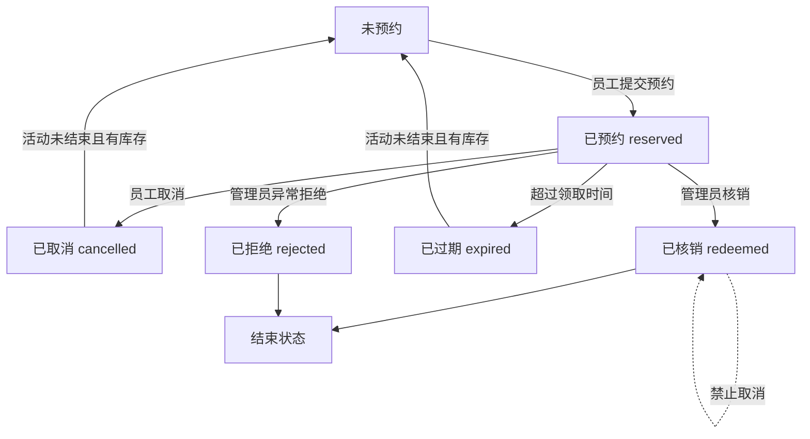

# GiftFlow 福利领取系统原型版 PRD

## 1. 产品定位

**产品名称**：GiftFlow 福利领取系统

**版本定位**：MVP 原型版，非生产级实现

**目标用户**：员工、行政管理员

**核心目标**：展示从“活动发布 -> 员工预约 -> 生成凭证 -> 现场核销 -> 库存变化 -> 数据统计”的完整福利领取闭环。

本版本重点验证核心业务流程，不追求生产级安全、真实外部系统集成和复杂企业级权限。

## 2. 本期范围

### 2.1 员工端

- 员工使用工号和手机号后四位登录
- 查看通知中心和未读通知
- 查看适用于自己的当前福利活动
- 查看本人可领取礼物
- 按部门自动过滤礼物资格
- 选择领取办公楼
- 查看该楼宇下本人可领取礼物
- 选择礼物
- 选择领取时间段
- 提交预约
- 生成领取凭证，包含验证码、二维码或领取详情
- 查看我的领取记录
- 取消未核销预约
- 接收活动上线、预约成功、改期提醒、取消、过期和核销成功通知
- 对管理员发起的改期提醒进行同意或不同意反馈

### 2.2 管理后台

- 模拟管理员登录
- 创建福利活动
- 使用自然语言输入活动规则
- 系统解析自然语言，生成结构化配置草稿
- 管理员在规则确认页手动修改并确认发布
- 维护礼物规则、楼宇分配、可领取日期
- 通过预约管理维护楼宇基础数据、具体领取时间段和可领取日历
- 查看预约列表
- 输入验证码或查看二维码信息完成核销
- 查看库存变化、预约状态和数据看板

### 2.3 页面导航

原型版拆成两个入口页面：

- 员工端
- 管理后台

入口切换使用左侧竖向导航，可以通过 URL 跳转。员工端为单入口业务页面，不展示管理菜单。

管理后台登录后，左侧竖向展示一级菜单。管理后台内部菜单使用页面会话状态切换，不通过 URL 跳转，以避免内部切换导致登录态丢失。

- 活动发布
- 预约管理
- 预约核销
- 数据看板

预约管理内部使用内容区顶部的横向分段切换：

- 楼宇视图
- 领取时间管理

## 3. 核心流程

### 3.1 员工流程

1. 员工使用工号和手机号后四位登录
2. 进入个人福利工作台
3. 查看通知中心和自己的可领活动
4. 选择领取办公楼
5. 查看该楼宇下本人可领取礼物
6. 选择礼物和领取时间段
7. 提交预约
8. 系统生成领取凭证
9. 现场由管理员核销
10. 领取记录变为已核销
11. 员工收到预约、改期、核销等状态通知

### 3.2 管理员流程

1. 管理员登录
2. 创建活动
3. 输入自然语言活动描述
4. 系统解析为配置草稿
5. 管理员进入规则确认页
6. 修改并确认活动发布配置
7. 发布活动
8. 管理楼宇基础数据
9. 查看员工预约
10. 现场核销凭证
11. 查看数据看板

## 4. 自然语言配置

### 4.1 功能定位

自然语言配置是**辅助录入工具**，不是自动发布工具。

它类似“解析简历后自动填表”：系统负责把自然语言拆成结构化草稿，管理员负责最终确认。

### 4.2 输入示例

> 2026 年春节福利，技术部可选机械键盘或降噪耳机，销售部领取 500 元购物卡，全员可领零食礼包。A 楼分配 50%，B 楼 30%，C 楼 20%。活动日期为 2 月 1 日到 2 月 3 日。

### 4.3 解析结果

系统生成以下配置草稿：

- 活动名称
- 活动开始日期和结束日期
- 礼物规则行
- 全员默认礼物
- 每个礼物的楼宇分配比例
- 可领取日期范围
- 每个时间段预约上限
- 是否允许取消预约
- 过期处理规则

### 4.4 人工确认规则

AI 解析结果不得直接发布。

管理员必须在规则确认页确认以下内容后，活动才可生效：

- 活动名称和日期
- 礼物名称、所属部门、初始数量、描述
- 每个礼物在各楼宇的库存分配比例
- 可领取日期范围，包含开始日期和结束日期
- 取消预约规则
- 过期释放规则

### 4.5 直接配置规则

管理员可以不使用文案解析，直接点击“配置活动”进入空白配置表单。

直接配置时，礼物规则按行新增，每行包含：

- 礼物名称
- 部门，下拉选择，来源于员工数据中的部门列表，并额外支持“全员”
- 初始数量，使用带加减控制的数字输入
- 描述

每一行礼物规则本质上同时定义了：

- 哪个部门可以领取该礼物
- 该礼物的初始库存
- 该礼物在员工端展示的说明文案

可领取日期由活动发布配置维护，每行只维护两个核心字段：

- 开始日期
- 结束日期

具体每天可预约的小时段不在活动发布表单中手工维护，由系统自动生成默认时段，并由“预约管理 > 领取时间管理”调整。
活动发布成功后，系统会根据开始日期和结束日期自动生成期间所有默认领取时段，作为员工端初始可预约 `timeslots`。

### 4.6 楼宇分配规则

楼宇为基础数据，由“预约管理 > 楼宇视图”维护。活动发布时不手写楼宇名称。

每个礼物规则下方展示当前启用楼宇的分配滑条：

- 每个楼宇一个比例滑条
- 同一礼物下所有楼宇比例合计必须等于 100%
- 发布活动时，系统按比例将该礼物初始库存分配到各楼宇
- 员工端先选择楼宇，再展示该楼宇下本人有资格且有库存的礼物

### 4.7 活动管理

活动管理集成在“活动发布”页中，用于维护已发布活动，不单独新增一级菜单。

原型版支持：

- 查看已发布和已下线活动列表
- 查看活动状态、日期范围、礼物数、已预约数、已核销数
- 编辑活动名称、描述、开始日期、结束日期、是否允许取消、是否过期释放库存
- 延长活动日期时，系统自动为新增日期生成默认 timeslots
- 缩短活动日期时，如果被移除日期已有任何预约记录，则禁止保存，并提示先联系改期或处理预约
- 查看活动礼物规则和楼宇库存
- 增发新礼物，并按活动当前楼宇进行库存分配
- 调整已有礼物库存，支持补充库存和减少可用库存
- 减少库存时只能减少当前可用库存，不能影响已预约和已发放库存
- 下线活动或恢复上线，操作需要二次确认

活动管理的限制：

- 不支持删除活动
- 不直接修改已有礼物的部门资格规则
- 不直接覆盖已有礼物库存，只允许通过库存调整增加或减少可用库存
- 不删除已有礼物
- 已下线活动不在员工端展示，且服务端拒绝新的员工预约；管理后台仍可查看历史预约、核销和数据

### 4.8 预约管理

预约管理用于维护活动发布后员工端实际看到的楼宇和 `timeslots`。

管理后台支持：

- 在页面内切换楼宇视图、领取时间管理
- 查看当前楼宇列表
- 新增楼宇
- 编辑楼宇地址、领取点、负责人、联系方式、备用负责人、显示顺序、状态和备注
- 选择活动
- 通过下拉栏选择某一天
- 通过单独的“新增时间段”按钮添加额外 timeslot
- 设置容量
- 发布到全部楼宇或单个楼宇
- 点击“快捷显示timeslot”按钮，将时段设为不可领取或恢复可领取
- 修改已发布时段容量
- 删除未被预约的时间段
- 对设为不可领取或恢复可领取操作进行二次确认

活动默认领取时段为：

```text
10:00-11:00
11:00-12:00
12:00-12:30
14:00-15:00
15:00-16:00
16:00-17:00
17:00-18:00
18:00-18:30
```

员工端依旧展示具体时间段，例如：

```text
2026-06-08 10:00-11:00
```

楼宇管理字段包括：

| 字段 | 说明 |
|---|---|
| 楼宇名称 | 如 A楼、B楼、C楼。已有楼宇不直接改名，以免影响历史库存和预约记录 |
| 楼宇地址 | 员工实际前往的办公地址 |
| 领取点位置 | 如 1层行政前台、3层行政服务台、B1 仓储发放点 |
| 负责人姓名 | 负责该楼宇发放或协调的行政人员 |
| 负责人联系方式 | 手机、企业微信或内线电话 |
| 备用负责人 | 负责人不在时的替补联系人 |
| 显示顺序 | 控制员工端和管理端楼宇展示顺序，使用 1、2、3 这类自然序号 |
| 楼宇状态 | 启用 / 停用。停用后员工端不再展示该楼宇 |
| 备注 | 特殊说明，如“需携带工牌”“进入仓储区需负责人带领” |

可领取日历以月视图展示可领取日。管理员点击具体日期后，可以看到：

- 当日在线活动
- 活动日期范围覆盖的所有月份
- 按楼宇和活动展示“快捷显示timeslot”
- “快捷显示timeslot”用于快速查看和切换每个领取时段的开启状态，有预约的时段保持高亮并自动展开预约信息，包括领取人、部门、活动、领取礼品、核销码
- “联系改期”操作入口，用于管理员处理已预约但需要调整时间的场景
- 点击“联系改期”后弹出短信通知窗口，管理员通过两个下拉栏选择目标日期和目标时间段
- 改期短信发送到员工手机号，短信内容为系统固定模板，并记录到 `operation_logs`
- 系统同时在员工端生成改期提醒通知，员工可以选择“同意改期”或“不同意”
- 员工同意改期时，系统重新校验目标 timeslot 是否仍可领取且未满员；校验通过后才更新预约时间
- 员工不同意改期时，仅记录反馈，不修改原预约
- 使用 `streamlit-calendar` 展示月视图，并以 FullCalendar 资源日历方式按楼宇展示当天 timeslots

### 4.9 快速配置 JSON

“文案快速配置”本质上是把文字转换为结构化 JSON，再将 JSON 填入配置表单。

目标 JSON 结构如下：

```json
{
  "activity": {
    "name": "2026年端午福利",
    "activity_type": "节日福利",
    "description": "活动说明",
    "start_date": "2026-06-08",
    "end_date": "2026-06-10",
    "allow_cancel": true,
    "expire_release": true
  },
  "gift_rules": [
    {
      "name": "机械键盘",
      "department": "技术部",
      "total_stock": 30,
      "description": "87键无线机械键盘",
      "building_allocation": {
        "A楼": 50,
        "B楼": 30,
        "C楼": 20
      }
    }
  ]
}
```

原型版可以先使用规则解析器生成活动和礼物规则 JSON；接入 AI 后，由模型直接输出同一 JSON 结构即可，页面和发布逻辑无需变化。具体 `timeslots` 由系统按活动日期自动生成默认时段，并可在预约管理中继续调整。

### 4.10 员工通知中心

员工登录后可以看到通知中心，通知用于承接活动上线、预约状态和改期处理。

通知类型包括：

- 活动上线：活动发布或恢复上线时，向符合资格规则的员工发送
- 预约成功：员工预约成功后发送
- 取消预约：员工取消预约后发送
- 改期提醒：管理员联系改期后发送，带目标日期和目标时间段
- 改期结果：员工同意改期后发送确认通知
- 预约过期：预约被标记过期后发送
- 核销成功：管理员核销后发送

改期提醒为可操作通知：

- 员工点击“同意改期”时，系统校验目标时间是否仍可领取、同活动、同楼宇且未满员
- 校验通过后，旧 timeslot 预约数减少，新 timeslot 预约数增加，预约记录更新到新时间
- 员工点击“不同意”时，仅记录处理结果，不改变预约

## 5. 领取状态机

### 5.1 流程图



### 5.2 状态说明

| 状态 | 含义 | 库存影响 | 是否可继续操作 |
|---|---|---|---|
| 未预约 | 员工尚未提交预约 | 无影响 | 可预约 |
| 已预约 | 员工已预约成功 | 占用库存 | 可取消、可核销、可过期 |
| 已取消 | 员工主动取消预约 | 释放库存 | 可重新预约 |
| 已核销 | 管理员完成现场发放 | 占用库存转为已发放 | 不可取消、不可重复核销 |
| 已过期 | 超过领取时间未领取 | 释放库存 | 可重新预约 |
| 已拒绝 | 管理员异常处理拒绝 | 释放库存 | 当前原型中作为结束状态 |

## 6. 库存扣减策略

原型版采用“预约占用库存”策略。

规则如下：

- 员工预约成功时，减少可用库存，增加占用库存
- 员工取消预约时，释放占用库存
- 预约过期时，释放占用库存
- 管理员核销时，占用库存转为已发放库存
- 同一员工在同一活动中默认只能有一条有效预约
- 礼物库存不足时，不允许预约
- 某楼栋某时间段达到预约上限时，不允许继续选择
- 每次库存变化都记录库存流水

库存字段建议：

- 总库存
- 可用库存
- 已占用库存
- 已发放库存
- 已释放库存

## 7. 资格规则

原型版优先支持**部门规则**和**全员默认礼物**。

规则如下：

- 管理员通过礼物规则行配置“部门 -> 礼物”
- 员工根据所属部门和所选楼宇看到对应礼物
- 如果礼物规则选择“全员”，则所有员工都可见
- 如果员工同时命中部门礼物和全员礼物，则都展示
- 每人每活动默认限领 1 份
- 如果同一活动下有多个可选礼物，员工只能选择其中 1 份预约

示例：

| 员工部门 | 可见礼物 |
|---|---|
| 技术部 | 机械键盘、降噪耳机、全员零食礼包 |
| 销售部 | 购物卡、全员零食礼包 |
| 职能部 | 全员零食礼包 |

## 8. 异常处理

本期必须覆盖以下异常：

- 重复预约：同一员工同一活动已有有效预约时，不允许再次预约
- 库存不足：提交预约时再次校验库存
- 时间段满员：提交预约时再次校验时间段容量
- 验证码错误：管理员核销失败并提示
- 重复核销：已核销凭证再次核销时提示已核销
- 已核销后取消：不允许取消
- 过期未领取：系统或管理员触发过期处理，释放库存
- 凭证转发：凭证需绑定员工和预约记录，核销时展示员工姓名供管理员核对
- 管理员误操作：记录操作日志，当前原型中不做复杂冲正
- 联系改期：管理员选择目标日期和目标时间段后，系统模拟发送固定短信到员工手机号、生成员工端改期通知并写入操作日志；员工同意后才变更预约时间

## 9. 数据表设计

核心表：

| 表名 | 用途 |
|---|---|
| employees | 员工信息 |
| admins | 管理员信息 |
| activities | 福利活动 |
| gifts | 礼物信息 |
| eligibility_rules | 资格规则 |
| buildings | 楼宇基础数据 |
| inventory | 楼栋维度库存 |
| time_slots | 领取时间段 |
| claims | 预约和领取记录 |
| notifications | 员工通知和可操作改期提醒 |
| inventory_logs | 库存流水 |
| operation_logs | 管理员操作日志 |

关键约束：

- `claims.activity_id + claims.employee_id` 默认只允许一条有效预约
- `claims.claim_code` 必须唯一
- 核销时必须校验 `claim_code`
- 库存变化必须写入 `inventory_logs`
- 管理员关键操作写入 `operation_logs`
- 员工通知写入 `notifications`
- 可操作改期通知通过 `action_status` 记录待确认、已同意或已不同意

## 10. 预约管理

预约管理用于维护活动发布后的领取基础数据和可预约时间。

原型版支持：

- 在页面内切换楼宇视图和领取时间管理
- 查看当前楼宇列表，新增楼宇，并维护地址、领取点、负责人和状态
- 查看活动日期范围内自动生成的默认领取时段
- 通过单独按钮新增时间段
- 在“快捷显示timeslot”中点击时间槽按钮停用或恢复时段，并进行二次确认
- 在时间修改区通过下拉栏修改容量或删除未预约时段
- 删除未预约的领取时间
- 以月日历查看可领取日和当日预约明细
- 对已预约记录设置“联系改期”操作入口
- 联系改期弹窗支持选择目标日期和目标时间段，并模拟发送固定短信到员工手机号，同时生成员工端可确认通知
- 活动发布时自动读取启用楼宇作为分配对象
- 员工端按楼宇展示可领取礼物

预约管理不等同于库存调整。库存调整仍由活动发布、预约、取消、过期和核销流程驱动。

## 11. 技术栈

原型版技术栈：

- 界面：Streamlit
- 数据库：SQLite
- 数据处理：Pandas
- 登录：员工端使用工号 + 手机号后四位，管理员端使用 Streamlit session state 模拟身份
- AI 解析：LLM 输出 JSON，或用规则解析/预设结果兜底
- 日历组件：使用 `streamlit-calendar` 展示月视图和按楼宇分组的日视图
- 二维码：生成二维码图片，或使用验证码模拟核销

## 12. 验收标准

原型通过标准：

- 管理员可以创建活动
- 自然语言可以生成配置草稿
- 配置草稿可以人工确认和修改
- 活动可以发布
- 员工端可以使用工号和手机号后四位登录
- 员工端可以查看通知中心和未读通知
- 活动发布后，符合资格规则的员工可以收到活动上线通知
- 预约成功、取消、过期、核销成功会生成员工通知
- 管理员联系改期后，员工端收到可操作改期通知
- 员工同意改期时，系统校验目标 timeslot 后更新预约时间
- 员工不同意改期时，系统记录反馈且不修改原预约
- 直接配置活动时，礼物清单初始为空，可通过新增礼物逐条配置
- 礼物配置字段包含礼物名称、部门、初始数量、描述
- 楼宇分配按滑条配置，同一礼物比例合计必须为 100%
- 活动发布配置只维护可领取日期范围
- 活动发布后自动生成日期范围内全部默认 timeslots
- 活动管理可以查看已发布和已下线活动
- 活动管理可以编辑活动基础信息和日期范围
- 活动日期延长时自动生成新增日期的默认 timeslots
- 活动日期缩短时，如果被移除日期已有预约记录，则禁止保存
- 活动管理可以增发新礼物，并按楼宇分配库存
- 活动管理可以调整已有礼物库存，增加库存或减少可用库存
- 减少库存数量超过当前可用库存时必须禁止操作
- 活动可以下线和恢复上线，下线后员工端不再展示
- 预约管理可以新增、停用、恢复、调整和删除某一天的具体领取时间段
- 停用或恢复时间段必须二次确认
- 预约管理可以用月日历查看可领取日、当日活动、“快捷显示timeslot”和预约明细
- 预约明细包含领取人、部门、活动、领取礼品和核销码，并提供联系改期按钮
- 联系改期按钮打开弹窗，可选择目标日期和目标时间段，模拟发送固定短信并记录操作日志
- 文案快速配置生成的 JSON 可以自动填入配置表单
- 管理后台可以新增楼宇
- 管理后台可以维护楼宇地址、领取点、负责人、联系方式、备用负责人、排序、状态和备注
- 员工端可以先选楼宇，再看到该楼宇下本人可领取礼物
- 员工端选择楼宇后可以看到该楼宇地址、领取点和负责人信息
- 员工只能看到自己有资格领取的礼物
- 员工可以完成预约
- 预约后库存变为占用
- 员工可以看到领取凭证
- 管理员可以核销凭证
- 核销后记录变为已核销
- 核销后库存变为已发放
- 取消预约后库存释放
- 重复预约、重复核销、库存不足有明确提示
- 看板能展示预约数、已核销数、剩余库存

## 13. 实施计划

### 13.1 基础闭环

- 搭建 Streamlit 页面结构
- 建 SQLite 数据表
- 初始化员工、礼物、活动演示数据
- 完成员工模拟登录
- 完成礼物展示和资格过滤
- 完成预约流程
- 完成凭证生成
- 完成基础库存占用逻辑

### 13.2 管理后台

- 完成管理后台活动发布
- 完成预约管理
- 完成文案快速配置草稿
- 完成规则确认页
- 完成核销功能
- 完成取消和过期处理
- 完成数据看板
- 补充异常提示和演示数据

## 14. 未来迭代

以下能力不进入当前 MVP 范围，统一作为未来迭代方向：

- 企业微信 OAuth 登录
- 企业微信消息通知
- 手机号短信验证码登录
- Excel 批量导入活动、员工和库存
- Excel 报表导出
- 扫码入库
- 批量打印标签或二维码
- 真实移动端扫码核销
- 多管理员复杂权限体系
- 管理员操作审计和冲正流程
- 按职级、入职时长、特殊员工名单配置资格规则
- 每人多份、多活动叠加等复杂领取规则
- 高并发库存锁
- Redis 缓存和分布式锁
- PostgreSQL 或 MySQL 替代 SQLite
- React / Vue 前端
- FastAPI / Django / Node.js 后端
- 生产级监控、告警、日志和回滚机制
- AI 自动生成活动总结报告
- AI 补货建议
- 更复杂的自然语言规则冲突检测
- 安全加固，包括凭证防转发、登录态校验、接口鉴权、数据加密
